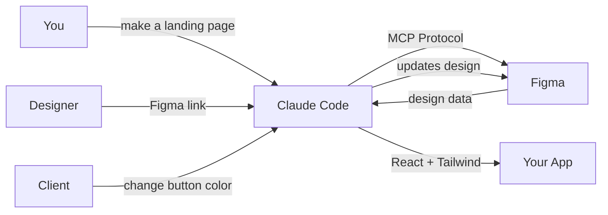

<p align="center">
  
  
  
</p>

<h1 align="center">Figma MCP — Design by Talking</h1>

<p align="center">
  <strong>Tell AI what you want. It reads Figma, writes Figma, and generates production code.</strong>
</p>

<p align="center">
  <a href="https://opensource.org/licenses/MIT"></a>
  
  
  
  
</p>

<p align="center">
  <a href="./README.ko.md">한국어</a> · English
</p>

---

## The Problem

```
Designer sends Figma link
→ Developer opens Figma, squints at spacing values
→ Types CSS by hand: "is that 16px or 18px padding?"
→ Builds component, checks browser, it looks wrong
→ Goes back to Figma, measures again
→ Repeat 47 times
→ Client says "actually, make the button green"
→ Start over
```

## The Solution

```
"Convert this Figma design to React + Tailwind"
[paste Figma URL]
→ Done. Production-ready code. 30 seconds.
```

---

## How It Works



```
Figma    = your whiteboard
MCP      = AI's eyes and hands on the whiteboard
Tools    = ingredients (flour, eggs) — read Figma files
Skills   = recipes (how to bake) — orchestrate tools in the right order
```

---

## Quick Install

```bash
curl -sL https://raw.githubusercontent.com/MadKangYu/MadKangYu-FigMa-Mcp/main/setup.sh | bash
```

<details>
<summary><strong>What gets installed</strong></summary>

| Component | Purpose |
|-----------|---------|
| Figma Desktop App | Design environment (via Homebrew) |
| Official Figma MCP | Read + write designs (OAuth) |
| figma-mcp-go | Unlimited usage, no rate limits |
| Plugin files | Bridge for Figma Desktop |
| Learning materials | 10 guides, 15 prompt patterns |

</details>

**One-time manual step:**
```
Figma Desktop → Plugins → Development → Import plugin from manifest...
→ ~/.figma-mcp-go-plugin/plugin-dist/manifest.json → Run
```

---

## 6 Real-World Scenarios

### 1. Clone a beautiful site

> "I love cal.com's design. I want something similar for my SaaS."

```
Import this website into Figma: https://cal.com
Figma file: [my URL]
```
AI grabs **actual element values** (colors, fonts, spacing) — not screenshots.
Change brand colors → done. No design skills needed.

### 2. Visualize before coding

> "I'm coding a dashboard but can't picture the layout."

```
Create a wireframe in Figma [URL]:
- Hero with headline + CTA
- Features 3-column grid  
- Pricing 3 plans
- Footer
Gray boxes only. No colors yet.
```
**Zero code touched.** See it first → approve → then convert.

### 3. Handle client feedback

> Client: "Make the hero green and add a testimonial section"

```
In Figma [URL]:
1. Change hero background from #1E40AF to #059669
2. Add testimonial section below pricing with 3 cards
```
Fix in Figma → client sees it instantly → approve → update code.
**Revision cycle ends at design level, not code level.**

### 4. App flow at a glance

> "I need to show investors all 5 screens of my app."

```
Create these screens side by side in Figma [URL] (375x812px, gap 80px):
1 - Splash  2 - Onboarding  3 - Login  4 - Home  5 - Settings
Arrange as a user flow with arrows.
```
Instant pitch deck. No PowerPoint needed.

### 5. Design to production code

> "Designer finished the Figma. I need React components."

```
Convert this Figma design to React + TypeScript + Tailwind:
[Dev Mode URL with &mode=dev]

Requirements:
- Functional components with TypeScript props
- Mobile-first responsive
- Accessibility (aria-label, role)
```
**Pro tip:** `&mode=dev` in the URL = higher quality code output.

### 6. Design system sync

> "Our Figma tokens don't match our Tailwind config."

```
Extract all color/spacing/typography variables from Figma [URL]
→ Convert to tailwind.config.js format
```
`#3B82F6` becomes `--color-primary`. Change once, updates everywhere.

---

## 3 Things to Remember

| # | Action | Prompt |
|---|--------|--------|
| 1 | **Design → Code** | `Convert this Figma design to React + Tailwind [URL]` |
| 2 | **Words → Design** | `Create a landing page in Figma [URL]. Hero + features + pricing.` |
| 3 | **Clone → Modify** | `Import https://cal.com into Figma [URL]` |

---

## Quality Cheatsheet

| Do this | Why | Impact |
|---------|-----|--------|
| Use `&mode=dev` in URL | AI reads layout structure, not just pixels | **+30% accuracy** |
| Request **section by section** | Prevents 20KB limit timeout | **No broken code** |
| Use Auto Layout in Figma | Generates Flexbox/Grid, not `position: absolute` | **Responsive works** |
| Clean layer names | `div_1234` → `.hero-button` | **Readable CSS** |
| Use Figma Variables | `#3B82F6` → `var(--color-primary)` | **Themeable code** |
| Specify full stack | "React + TypeScript + Tailwind CSS" | **Exact output** |

---

## Architecture

```
┌─────────────────────────────────────────────────┐
│                  Your Workflow                    │
├─────────────┬──────────────┬────────────────────┤
│   READ      │   WRITE      │   CONVERT          │
│             │              │                    │
│ get_file    │ use_figma    │ react-component    │
│ get_styles  │ generate_    │ html-css           │
│ get_comps   │   figma_     │ tailwind           │
│ get_vars    │   design     │ design-tokens      │
│ get_images  │ create_new_  │                    │
│ get_code_   │   file       │                    │
│   connect   │              │                    │
├─────────────┴──────────────┴────────────────────┤
│              get_design_context                  │
│         (does 90% of the work alone)             │
├─────────────────────────────────────────────────┤
│                 MCP Protocol                     │
├──────────────────┬──────────────────────────────┤
│  Official Figma  │  figma-mcp-go (unlimited)    │
│  (OAuth, stable) │  (plugin bridge, no limits)  │
└──────────────────┴──────────────────────────────┘
```

## 7 Official Skills (Ranked)

| Rank | Skill | When to use |
|:----:|-------|-------------|
| ⭐⭐⭐ | `figma-implement-design` | Every day — design → code |
| ⭐⭐⭐ | `figma-use` | Auto-loaded before any write operation |
| ⭐⭐ | `figma-generate-design` | Creating new screens in Figma |
| ⭐⭐ | `figma-create-design-system-rules` | Project setup — generates CLAUDE.md rules |
| ⭐ | `figma-generate-library` | Building full design systems (20-100+ calls) |
| ⭐ | `figma-code-connect` | Component ↔ code mapping (Org plan+) |
| — | `figma-create-new-file` | Just creates a blank file |

> **Starting out? You only need `figma-implement-design`.** Everything else is optional.

---

## MCP Servers Compared

| Server | Read | Write | Rate Limit | Best For |
|--------|:----:|:-----:|-----------|----------|
| **Official Figma** | ✅ | ✅ | Free: 6/mo, Pro: 200/day | Stability + `use_figma` |
| **figma-mcp-go** | ✅ | Basic | **Unlimited** | Free plan users |
| Framelink | ✅ | ❌ | Unlimited | Read-only, token-efficient |
| Grab/cursor-talk | ✅ | ✅ | Unlimited | Cursor + WebSocket |
| figma-console | ✅ | ✅ | OAuth | 92 tools, but unstable on macOS |

**Recommended combo:** Official (stable writes) + figma-mcp-go (unlimited reads)

---

## Free vs Paid

| | Free ($0) | Pro Dev ($12/mo) | Pro Full ($16/mo) |
|---|:---------:|:----------------:|:-----------------:|
| MCP calls | 6/month | 200/day | 200/day |
| `use_figma` write | ❌ | ✅ | ✅ |
| Dev Mode | ❌ | ✅ | ✅ |
| Variables | — | Read only | 10 modes |
| Code Connect | ❌ | ❌ | ❌ (Org only) |
| **With figma-mcp-go** | **Unlimited reads** | **Unlimited reads** | **Unlimited reads** |

> **Best value: Pro Dev seat at $12/mo.** Free + figma-mcp-go works for learning.

---

## 10 Pain Points & Solutions

| Problem | Solution | Auto? |
|---------|----------|:-----:|
| Rate limit (6/month) | figma-mcp-go installed | ✅ |
| 20KB output limit | Section-by-section workflow | 📋 |
| No Auto Layout = bad code | "Add Auto Layout first" pre-prompt | 📋 |
| Custom fonts fail | Specify in prompt + Tailwind config | 📖 |
| Images not included | `get_images` → extract first | 📋 |
| 85-90% accuracy | Dev Mode URL + 2-3 revision rounds | 📋 |
| `figma-use` not loaded | CLAUDE.md auto-load rule | ✅ |
| WebSocket drops | Official Remote as primary | ✅ |
| Dev Mode requires Pro | CSS inspect is free, full mode is paid | 📖 |
| Figma Make confusion | Different product entirely | 📖 |

> ✅ = automated in this repo, 📋 = template provided, 📖 = guide included

---

## Font Guide

### Safe for MCP (Commercial Free)

| Category | Top Picks |
|----------|-----------|
| **Sans-serif** | Inter, Roboto, Poppins, DM Sans, Plus Jakarta Sans |
| **Serif** | Playfair Display, Merriweather, Lora |
| **Monospace** | JetBrains Mono, Fira Code |
| **Korean** | Noto Sans KR ✅, IBM Plex Sans KR ✅, NanumGothic ✅ |
| **Korean (local only)** | Pretendard ❌ MCP, Spoqa Han Sans ❌ MCP |

> All Google Fonts = SIL OFL = **free for commercial use**.
> Pretendard needs manual `@font-face` setup in code.

---

## Documentation

| File | Content | For |
|------|---------|-----|
| [`01-getting-started.md`](./01-getting-started.md) | Install + first 20 minutes | Beginners |
| [`02-core-concepts.md`](./02-core-concepts.md) | MCP concepts + when to use | Understanding |
| [`03-tools-and-skills.md`](./03-tools-and-skills.md) | 17 tools + 7 skills + rankings | Reference |
| [`04-workflows.md`](./04-workflows.md) | 8 workflows + 15 prompt patterns | Copy-paste |
| [`05-resources.md`](./05-resources.md) | Official docs, GitHub, npm | Deep dive |
| [`06-glossary.md`](./06-glossary.md) | 40+ terms explained simply | Non-developers |
| [`07-pain-points.md`](./07-pain-points.md) | 10 problems + solutions | Troubleshooting |
| [`08-fonts-and-pricing.md`](./08-fonts-and-pricing.md) | Fonts + free vs paid plans | Planning |
| [`QnA.md`](./QnA.md) | 15 real Q&As from learning | FAQ |
| [`CLAUDE.md`](./CLAUDE.md) | Auto-applied AI rules | Automatic |

---

## Auto Update

```bash
curl -sL https://raw.githubusercontent.com/MadKangYu/MadKangYu-FigMa-Mcp/main/update.sh | bash
```

---

## Contributing

PRs welcome. If you found a better prompt pattern or workflow, share it.

---

<p align="center">
  <strong>Don't build from scratch. Import good designs and modify.</strong><br/>
  <strong>Preview in Figma first. Convert to code only after approval.</strong><br/><br/>
  <em>Figma is not a design tool — it's a <b>communication tool</b>.</em>
</p>
